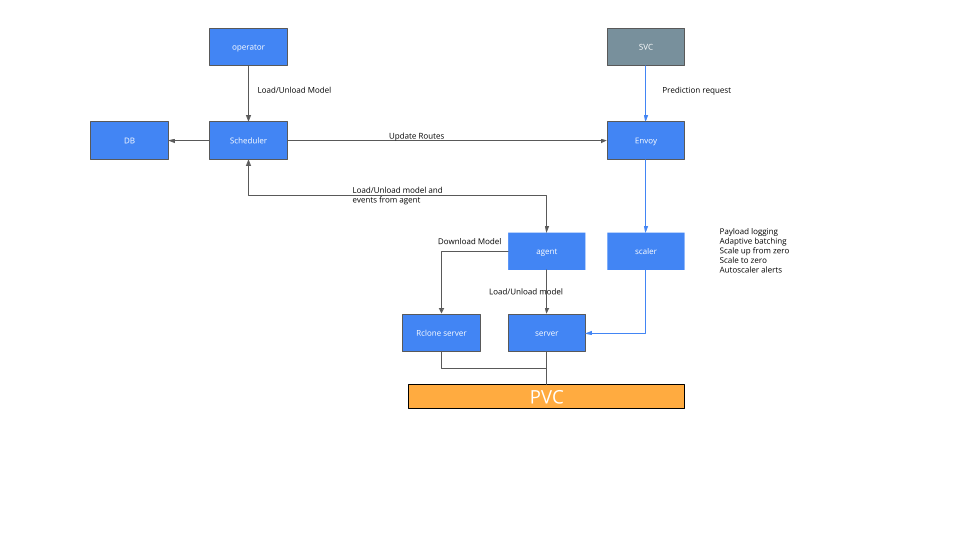

# Design



 * **Operator**
    * Calls scheduler with load/unload model requests
 * **Agent**
    * Runs on each server pod. On start calls scheduler to inform of new server replica with given capabilities, memory.
    * Hanldes load requests:
      * Tell rclone server to download artifacts
      * Tell server to load/unload model
 * **Sheduler**
    * Assigns models to server replicas
    * Manages grpc connections to:
       * Agent to load/unload models assigned to a replica
       * Envoy to update routing to replicas for models
 * **Server**
    * V2 compatible ML server
 * **Rclone**
    * Rclone server to download artifacts onto local PVC
 * **DB**
    * State of truth store for model->server mapping
 * **Scaler**
    * Handles possble:
       * Scale to zero
       * Scale from zero
       * Payload logging


## Agent-scheduler design

Requirements:

  * Handle server updates, e.g. user changes server configuration (more memory, different image with capabilities (sklearn, alibi etc)
  * Handle server failures

Due to above current design:
  * Agent calls schedueler on startup when pod is ready and informs scheduler of new replica with a server with given capabilities
  * Scheduler tells agent of models to load
  * Scheduler handles loss of grpc connection by rescheduling models (if possible)
  * Scheduler reschedules failed scheduling models when replicas restart

## Scheduler design

Requirements:

 * Handle core state of truth for model->server mapping
 * Update via a "scheduling algorithm"
 * Handle syncing of Envoy and Agents when model->server changes
 * Handle running as multiple pods with remote DB storage


## GRPC Services

 * [Scheduler](../apis/mlops/scheduler/scheduler.proto)
 * [agent](../apis/mlops/agent/agent.proto)


## Model Replica State

A model state can be in a set of states. 

```golang
const (
	ModelStateUnknown ModelState = iota
	ModelProgressing
	ModelAvailable
	ModelFailed
	ModelTerminating
	ModelTerminated
	ModelTerminateFailed
	ScheduleFailed
)
```

And the underlying model replicas can be in a set of states.

```golang
const (
	ModelReplicaStateUnknown ModelReplicaState = iota
	LoadRequested
	Loading
	Loaded
	LoadFailed
	UnloadEnvoyRequested
	UnloadRequested
	Unloading
	Unloaded
	UnloadFailed
	Available
	LoadedUnavailable
	Draining
)
```

The idea is the core scheduler, the scheduler-agent server and the scheduler-envoy can in theory all work independently with the later two syncing when a model state changes.

### Scheduler
#### Loading
 1. Scheduler gprc receives load model rpc
 1. Scheduler assigns model to 1 or more replicas updating the core model->server state
    1. Model replica state it set to `LoadRequested` and Model state is set to `ModelProgressing`

#### Unloading
 1. Scheduler gprc receives unload model rpc
 1. Scheduler removes model replicas updating the core model->server state
    1. Model replica state it set to `UnloadEnvoyRequested` and Model state is set to `ModelTerminating`

### Scheduler-Agent

When it syncs

#### Loading
 1. Agent-server sees model replica is `LoadRequested`
    1. A load request to agent for desired replicas and changes state to `Loading`
    1. When model is loaded agent sends Event update to scheduler and scheduler sets state to `Loaded`

#### Unloading
 1. Agent-server sees model replica is `UnloadRequested`
    1. An unload request to agent for desired replicas and changes state to `Unloading`
    1. When model is unloaded agent sends Event update to scheduler and scheduler sets state to `Unloaded`

### Scheduler-Envoy
 1. Envoy syncs and updates mapping for any models it sees that have state `Loaded` to be `Available` and removes any whose state is not `Loaded`
 1. Envoy sets all model replicas marked as `UnloadEnvoyRequested` to `UnloadRequested`, which would trigger Agent-server model replica unload

